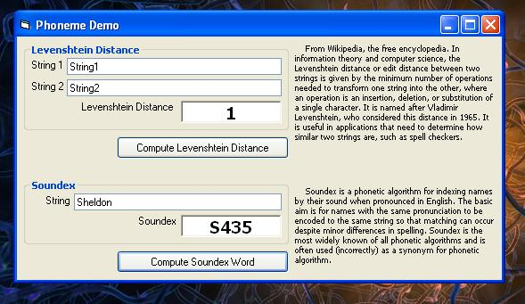



## Soundex and Levenshtein Distance Demo

### Description

Soundex and Levenshtein Distance algorithms are very exhaustivey used in searching and spell check applications. Soundex is used to select words which 'SOUND LIKE' another word EX: Bryan and Brian

Levenshtein Distance is the minimum number of steps required to transform one string to another. This algorithm can be effectively used to narrow down the number of possible matches for a given string. This can be useful in 'refining' your search results according to a threshold value.
 
### More Info
 

             |
---                |---
**Submitted On**   |2006-07-16 12:10:02
**By**             |[Shelz](https://github.com/Planet-Source-Code/PSCIndex/blob/master/ByAuthor/shelz.md)
**Level**          |Beginner
**User Rating**    |5.0 (10 globes from 2 users)
**Compatibility**  |VB 6\.0
**Category**       |[String Manipulation](https://github.com/Planet-Source-Code/PSCIndex/blob/master/ByCategory/string-manipulation__1-5.md)
**World**          |[Visual Basic](https://github.com/Planet-Source-Code/PSCIndex/blob/master/ByWorld/visual-basic.md)
**Archive File**   |[Soundex\_an2006967162006\.zip](https://github.com/Planet-Source-Code/shelz-soundex-and-levenshtein-distance-demo__1-65985/archive/master.zip)

